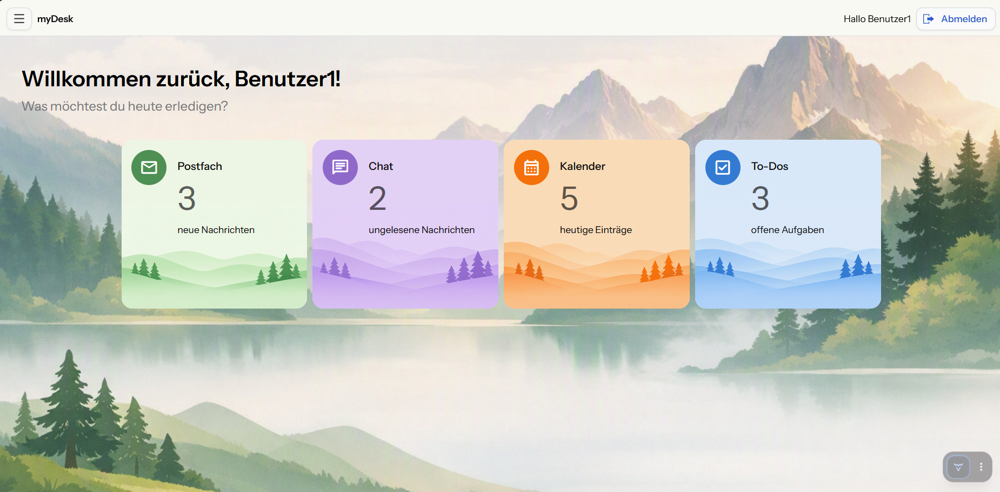

# 🖥️ myDesk

**myDesk** ist eine moderne Webanwendung für persönliche Organisation, Kommunikation und Produktivität.

Die Anwendung vereint **Todos, Kalender, Nachrichten und weitere Produktivitätsfunktionen** in einer zentralen Oberfläche.



## ✨ Features

* 📊 **Dashboard** – personalisierte Startseite mit Übersicht
* ✅ **Todo-Liste** – persönliche Aufgaben erstellen und verwalten
* 📅 **Kalender** – Termine mit FullCalendar verwalten
* ✉️ **Nachrichten** – Nachrichten senden, empfangen und beantworten
* 📎 **Anhänge** – Dateien an Nachrichten anhängen
* 👤 **Benutzerverwaltung** – persönliche Daten und Funktionen pro Benutzer
* 🔐 **Authentifizierung** – abgesicherter Benutzerzugriff

## 🛠️ Technologie-Stack

| Bereich     | Technologie           |
| ----------- | --------------------- |
| Sprache     | Java 21               |
| Backend     | Spring Boot 4.1.0     |
| UI          | Vaadin 25.2.0         |
| Datenbank   | PostgreSQL            |
| Persistenz  | Spring Data JPA       |
| Migrationen | Flyway                |
| Sicherheit  | Spring Security       |
| Kalender    | FullCalendar for Flow |
| Build       | Maven                 |

## 🚀 Installation

### Voraussetzungen

* Java 21+
* Maven 3.6+
* PostgreSQL

### Projekt klonen

```bash
git clone https://github.com/NikW5/myDesk.git
cd myDesk
```

### Anwendung starten

```bash
mvn spring-boot:run
```

Anschließend ist die Anwendung unter **http://localhost:8080** erreichbar.

## 📁 Projektstruktur

```text
myDesk/
├── src/
│   ├── main/java/          # Java-Quellcode
│   ├── main/resources/     # Ressourcen & Konfiguration
│   └── test/               # Tests
├── pom.xml                 # Maven-Konfiguration
├── mvnw / mvnw.cmd         # Maven Wrapper
└── README.md
```

## 🔗 Repository

[GitHub – NikW5/myDesk](https://github.com/NikW5/myDesk)

---

**myDesk befindet sich in aktiver Entwicklung und wird kontinuierlich um neue Funktionen erweitert.**
